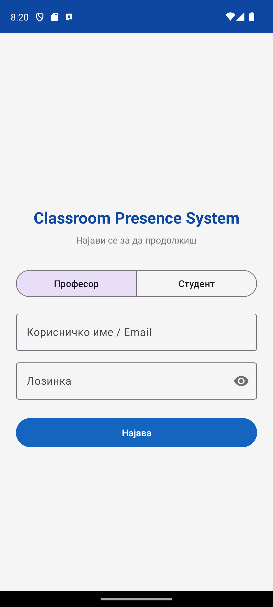
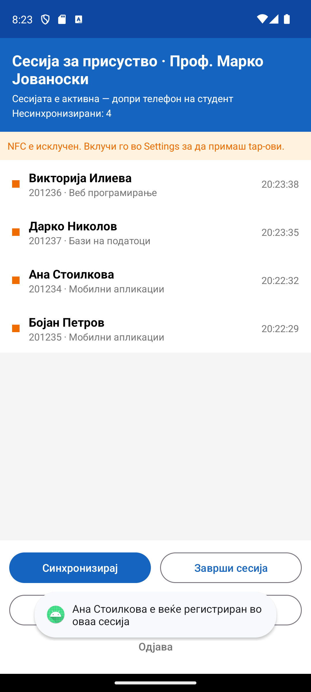
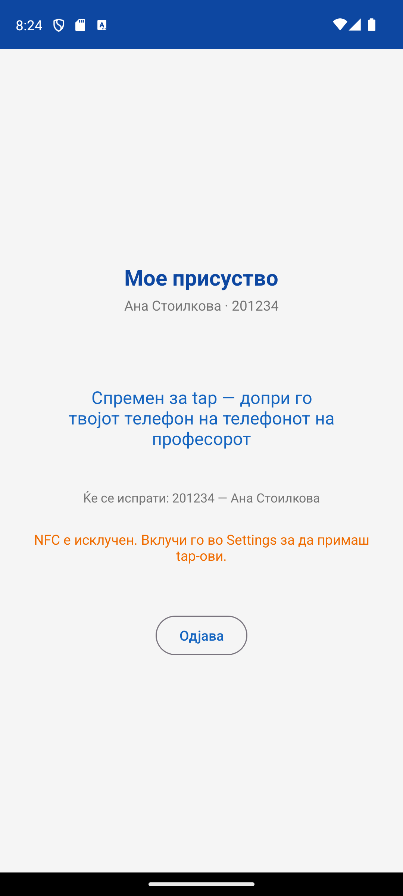
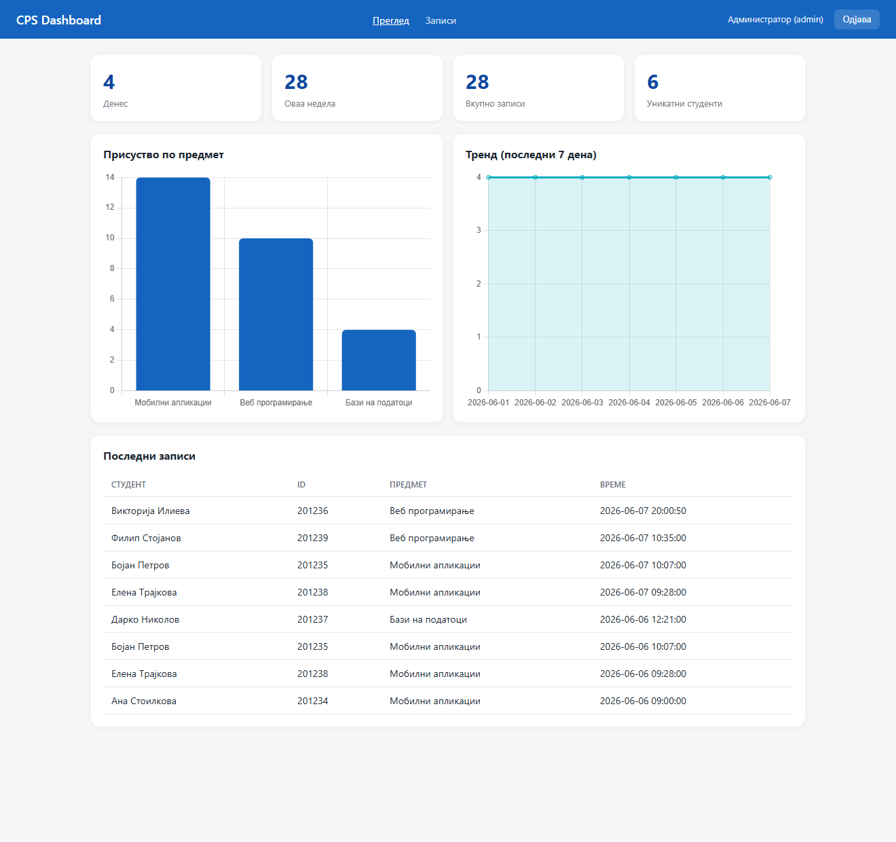

# Classroom Presence System (CPS)

A distributed classroom attendance system. Students register their presence by **tapping their phone
against the teacher's phone** using **NFC (Host-based Card Emulation)**. The teacher's device collects
taps, stores them locally (offline-safe), and syncs them to a **PHP/MySQL** backend. A **web dashboard**
visualizes the data with charts and filterable tables.

> Course: Развој на мобилни апликации · Team Project · 2026

## Features

- 👤 **Two roles, one app** — login routes to the Teacher or Student experience.
- 📲 **NFC / HCE attendance** — student phone acts as an NFC card (Host-based Card Emulation),
  teacher phone reads it in reader mode.
- 🔐 **Secure dynamic payload** — the broadcast is an HMAC-SHA256 signed, 5-minute token
  (not a static student ID), resisting replay/cloning.
- 💾 **Offline-first** — taps are saved to a local **Room** database and uploaded on demand;
  the app keeps working with no connection and syncs when it returns.
- 🔄 **Bulk sync with feedback** — pending-record counter and a progress indicator during upload.
- 🧾 **Duplicate protection** — one record per student/teacher/day, enforced on-device and server-side.
- 🌐 **REST backend (PHP/MySQL)** — JWT auth, `password_hash`, pagination, role-based access.
- 📊 **Web dashboard** — interactive **Chart.js** bar & line charts, stat cards, filterable records table.
- 🛡️ **Role-based access** — teachers see only their own classes; admins see everything.
- ✅ **Tested & documented** — JVM unit tests + OpenAPI specification.

## Screenshots

| Login | Teacher session | Student | Web dashboard |
|---|---|---|---|
|  |  |  |  |

## Authors

- **Riste Semenkovski** — 102741
- **Bojan Novkovski** — 102715

## Components

| Component | Tech | Location |
|---|---|---|
| Mobile app (Teacher + Student, one app, role chosen at login) | **Android, Java**, MVVM, Room, Retrofit, NFC/HCE | repo root (`app/`) |
| Backend REST API | **PHP + MySQL**, PDO, JWT (HS256) | `backend/` |
| Web dashboard | HTML/CSS/JS, **Chart.js** | `dashboard/` |
| Database schema | MySQL | `database/schema.sql` |

## Architecture

```
[Student phone]  --NFC tap (HCE payload: student_id, name, course)-->  [Teacher phone (reader mode)]
                                                                              |
                                                                     Room (local, offline)
                                                                              |  sync (Retrofit + JWT)
                                                                  [PHP REST API]  <-->  [MySQL]
                                                                              ^
                                                                  [Web dashboard / Chart.js]
```

The student app registers an HCE service (`StudentApduService`) with a custom AID. The teacher app uses
`NfcAdapter` reader mode; on a tap it selects the AID over ISO-DEP, reads the JSON payload, stores it in
Room with a timestamp, and uploads pending records on demand.

## Setup

### 1. Backend (XAMPP)

1. Install **XAMPP**, start **Apache** and **MySQL**.
2. Copy the `backend/` folder and the `dashboard/` folder into `xampp/htdocs/cps/` so you have:
   ```
   htdocs/cps/api/...      (login.php, attendance.php, statistics.php)
   htdocs/cps/config/...
   htdocs/cps/helpers/...
   htdocs/cps/seed.php
   htdocs/cps/dashboard/...
   ```
3. Import the schema: open **phpMyAdmin** → Import → `database/schema.sql` (creates the `cps` database).
4. Seed demo users + sample data: open <http://localhost/cps/seed.php> once in the browser.

### 2. Web dashboard

Open <http://localhost/cps/dashboard/index.html>.

Demo logins:
- **admin / admin123** (role *Администратор*) — sees all data
- **prof / test123** (role *Професор*) — sees only their own classes (role-based access)

### 3. Android app

1. Open the project root in **Android Studio** and let Gradle sync.
2. The API base URL is in `app/.../data/remote/RetrofitClient.java`:
   - **Emulator:** `http://10.0.2.2/cps/` (already set — `10.0.2.2` is the host machine).
   - **Real device:** change to your computer's LAN IP, e.g. `http://192.168.1.10/cps/`.
3. Run on a device/emulator.

Demo logins:
- Teacher: **prof / test123**
- Student: **student / test123**

## Using it

- **Teacher:** log in → an attendance session starts automatically and the phone enters NFC reader mode.
  Each student tap appears in the live list. Press **Синхронизирај** to upload. Works offline — records
  stay local and upload when a connection returns. **Симулирај tap** adds a demo record so the full
  flow can be tested on an emulator without NFC hardware.
- **Student:** log in → the phone is ready as an NFC card; tap it on the teacher's phone. A confirmation
  appears when the tap is read.

## API

| Method | Endpoint | Auth | Purpose |
|---|---|---|---|
| POST | `/api/login.php` | – | Authenticate, returns JWT + profile |
| POST | `/api/attendance.php` | JWT | Bulk upload attendance (dedupes per student/teacher/day) |
| GET | `/api/attendance.php` | JWT | List records; filters: `date`, `course`, `student`, `teacher`, `limit`, `offset` |
| GET | `/api/statistics.php` | JWT | Totals (today/week/all), per-course counts, 7-day trend |

Security: passwords hashed with `password_hash` (bcrypt); endpoints protected by HMAC-SHA256 JWT;
role-based access (teachers scoped to their own data, admins see all).

Full API contract: [`backend/openapi.yaml`](backend/openapi.yaml) (OpenAPI 3.0 — paste into
[editor.swagger.io](https://editor.swagger.io) to browse interactively).

## Security of the NFC payload

Instead of broadcasting a static plaintext student ID, the student app wraps the payload in a
**short-lived, HMAC-SHA256 signed token** (`SecureToken`): `base64(payload).issuedAt.signature`.
The teacher app verifies the signature and rejects tokens older than 5 minutes, mitigating replay and
cloning of a captured tap. Rapid repeated taps from the same student in one session are de-duplicated
both on-device (Room) and server-side (UNIQUE key).

## Testing

JVM unit tests cover the critical parsing/security logic:
`StudentPayloadTest` (payload round-trip), `NfcProtocolTest` (APDU build/parse),
`SecureTokenTest` (sign/verify, tamper & malformed rejection).

```
./gradlew test
```

## NFC note

NFC/HCE requires **two physical NFC-capable Android phones** and cannot run on an emulator. The full HCE
code is implemented (signed, time-limited payload — see above) and graded by review; for emulator testing
the **Simulate tap** button exercises the same Room → sync → dashboard pipeline.

## References / libraries

- [AndroidX Room](https://developer.android.com/training/data-storage/room) — local persistence
- [Retrofit](https://square.github.io/retrofit/) + [OkHttp](https://square.github.io/okhttp/) — HTTP client
- [Material Components for Android](https://github.com/material-components/material-components-android)
- [Android HCE](https://developer.android.com/develop/connectivity/nfc/hce) — Host-based Card Emulation
- [Chart.js](https://www.chartjs.org/) — dashboard charts
- JWT (HS256) — minimal self-contained implementation in `backend/helpers/Jwt.php`
